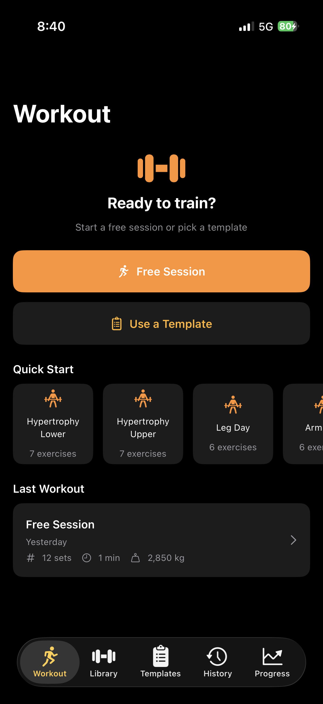
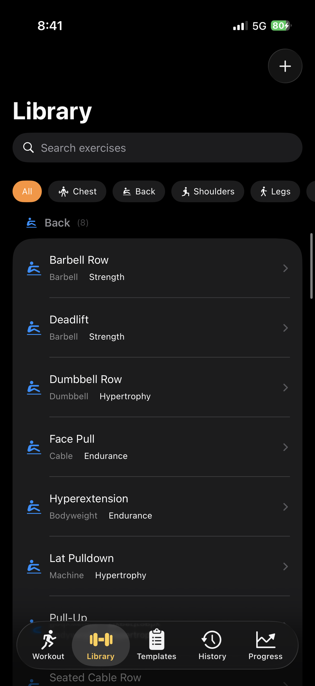
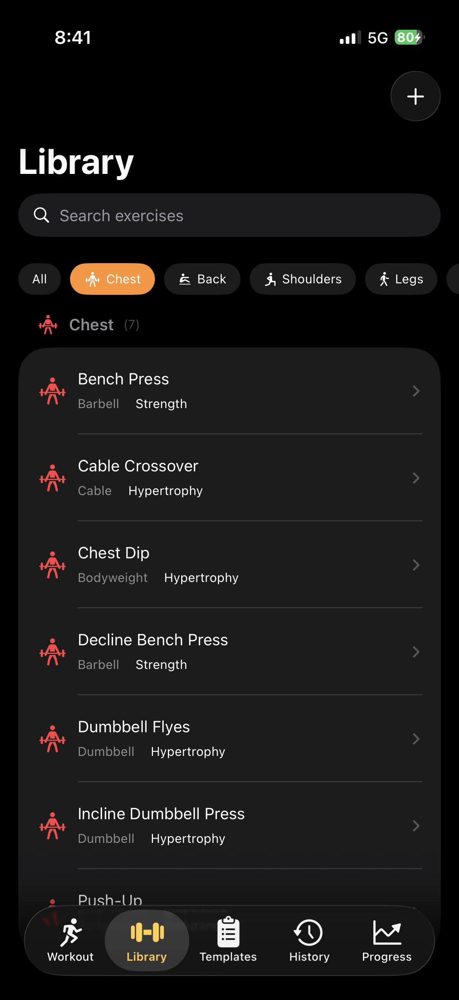
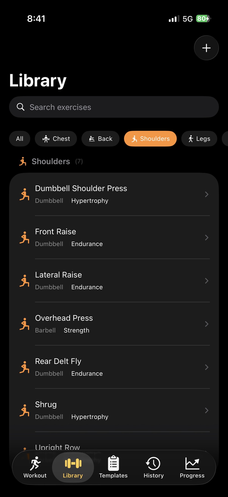
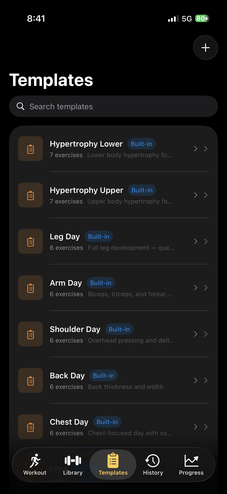
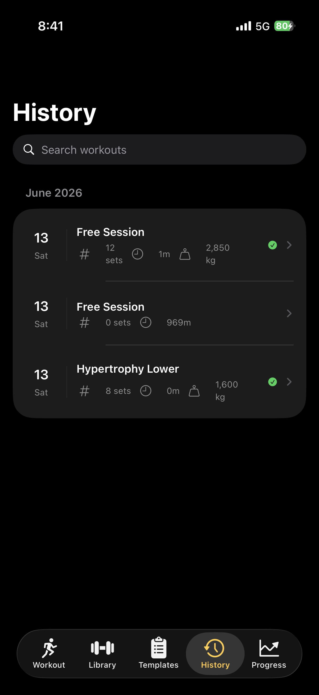
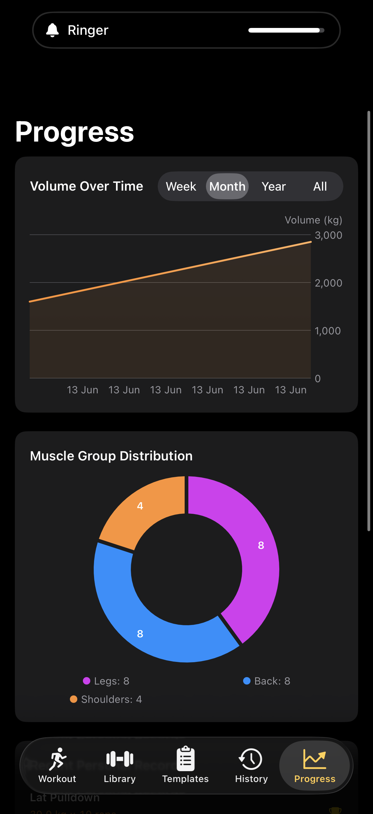
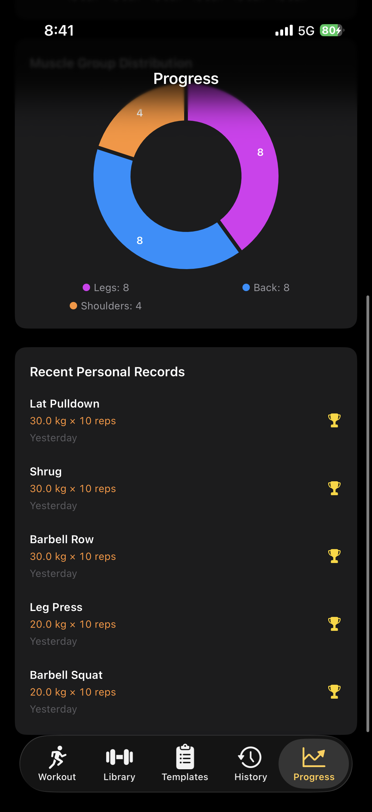
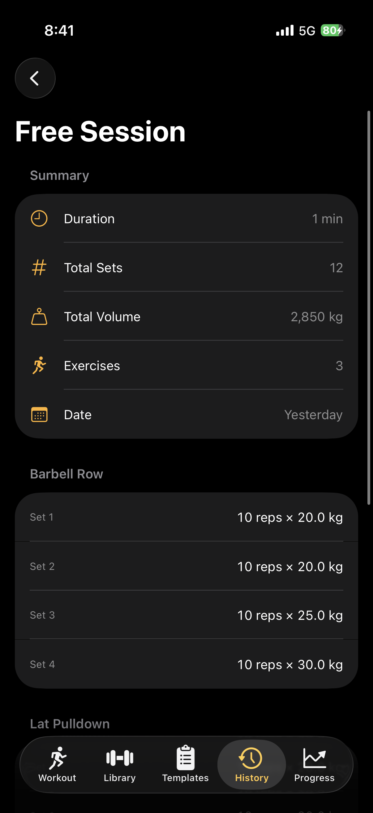
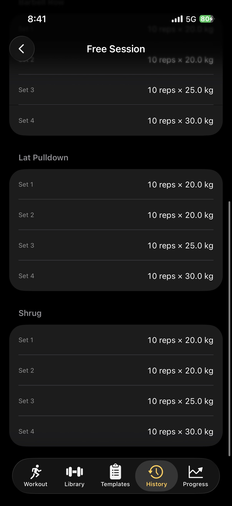

# GymTracker | Personal Project | iOS App SwiftUI SwiftData WidgetKit

GymTracker is a comprehensive gym workout tracking app for iPhone built with SwiftUI and SwiftData. It features an exercise library with 50+ built-in exercises organized by muscle group, customizable workout templates, active session logging with set-by-set tracking, a rest timer with haptic feedback, and detailed progress charts. The app also includes a home screen widget showing the last workout summary and a Live Activity for Dynamic Island support during active sessions.

In this project, I was responsible for building the full application from scratch using SwiftUI, SwiftData, Swift Charts, WidgetKit, and ActivityKit. I implemented the exercise library with rep-range tagging (strength / hypertrophy / endurance), the workout template system with 12 built-in routines, active workout logging with RPE and warmup markers, the rest timer with configurable countdown and haptic feedback, progress visualization using Swift Charts, and both the WidgetKit widget and Live Activity extension for real-time workout updates.

## Features

- **Exercise Library** — 50+ built-in exercises categorized by muscle group, with rep-range tagging (strength / hypertrophy / endurance)
- **Custom Exercises** — Create your own exercises with custom muscle group, equipment, and rep-range
- **Workout Templates** — 12 built-in routines: Full Body, Upper/Lower, Push Pull Legs, Bro Split, and Hypertrophy programs. Create and customize your own.
- **Active Workout Logging** — Log sets with reps, weight, RPE, and warmup markers. Navigate between exercises mid-session.
- **Rest Timer** — Configurable countdown timer between sets with haptic feedback
- **History** — Browse past workout sessions with full set-by-set breakdown
- **Progress Charts** — Volume over time, muscle group distribution, personal records, and per-exercise progress graphs using Swift Charts
- **Widget** — Last workout summary on your home screen
- **Live Activity** — Dynamic Island support showing current exercise and progress during an active workout

## Requirements

- iOS 18.0+
- Xcode 16.0+
- Swift 6.0

## Getting Started

1. Open `GymTracker.xcodeproj` in Xcode
2. Select an iOS 18+ simulator or connected device
3. Build and run (⌘R)

The app seeds exercise data and built-in templates automatically on first launch.

## Project Structure

```
GymTracker/
├── App/                  # Entry point and root view
├── Models/               # SwiftData @Model classes
├── Views/
│   ├── Workout/          # Active workout flow
│   ├── Library/          # Exercise browser
│   ├── Templates/        # Routine management
│   ├── History/          # Past sessions
│   ├── Progress/         # Charts and stats
│   ├── Settings/         # App configuration
│   └── Components/       # Reusable UI components
├── Services/             # WorkoutManager, RestTimer, SeedData
├── Extensions/           # Color palette, date formatters
└── Resources/            # exercises.json, asset catalog
```

## Tech Stack

- SwiftUI with programmatic navigation (`NavigationStack`)
- SwiftData for persistence
- Swift Charts for progress visualization
- WidgetKit for home screen widgets
- ActivityKit for Live Activities
- XcodeGen for project generation

## Screenshots
<table>
  <tr>
    <td align="center"></td>
    <td align="center"></td>
    <td align="center"></td>
    <td align="center"></td>
  </tr>
  <tr>
    <td align="center"></td>
    <td align="center"></td>
    <td align="center"></td>
    <td align="center"></td>
  </tr>
  <tr>
    <td align="center"></td>
    <td align="center"></td>
    <td align="center"></td>
    <td align="center"></td>
  </tr>
</table>
